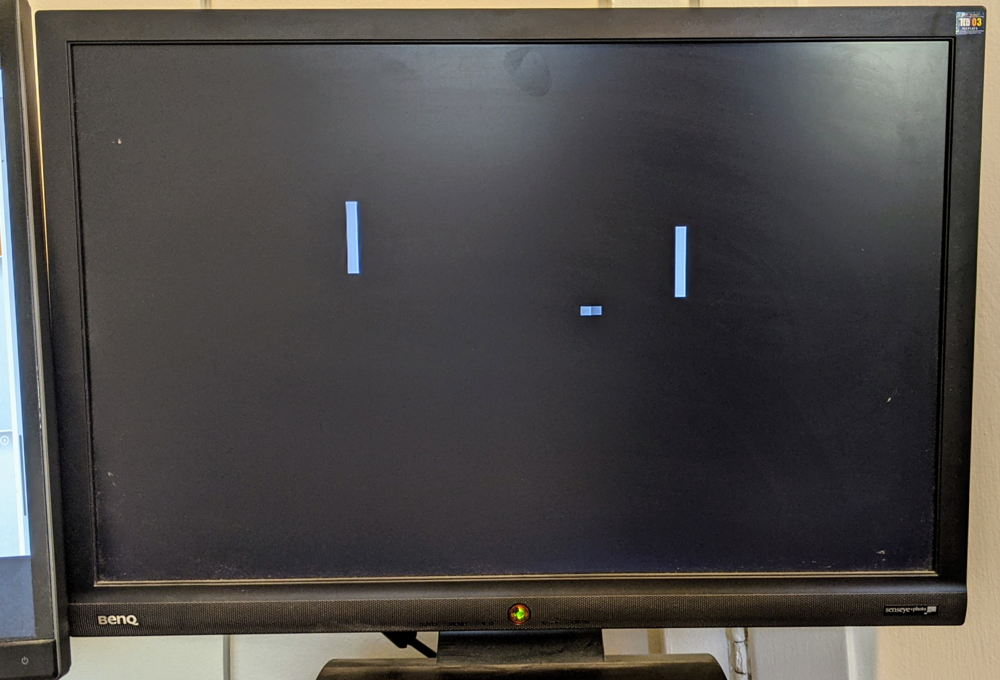
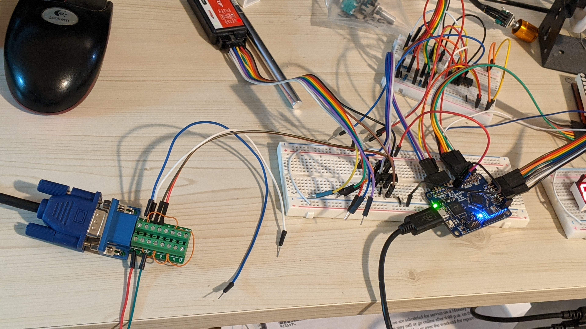

# Pong on an FPGA

This is a pure hardware implementation of Pong in Verilog and runs on the
Lattice iCE40 FPGA.

Output is over VGA using a 6-bit resistor DAC, producing 64 colors (although
only black and white is currently used).

It also contains a 16x16 dot matrix screen output for v0.1 version of the
https://github.com/erikvanzijst/dotmatrix project, and a score board using
7-segment displays, counting up to 9 for each player.

The paddles are controlled by 2 [Bourns PEC11R-4020F-S00024](https://www.jameco.com/webapp/wcs/stores/servlet/ProductDisplay?productId=2323551)
rotary encoders.

More context on Twitter:

<blockquote class="twitter-tweet">
I bought my first FPGA to see if this old software dog can still learn new tricks.
&mdash; Erik van Zijst (@erikvanzijst) <a href="https://twitter.com/erikvanzijst/status/1388668730163359747?ref_src=twsrc%5Etfw">May 2, 2021</a></blockquote>
